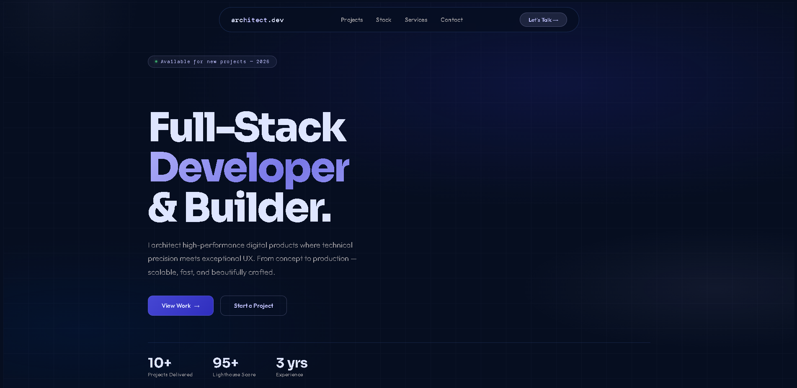
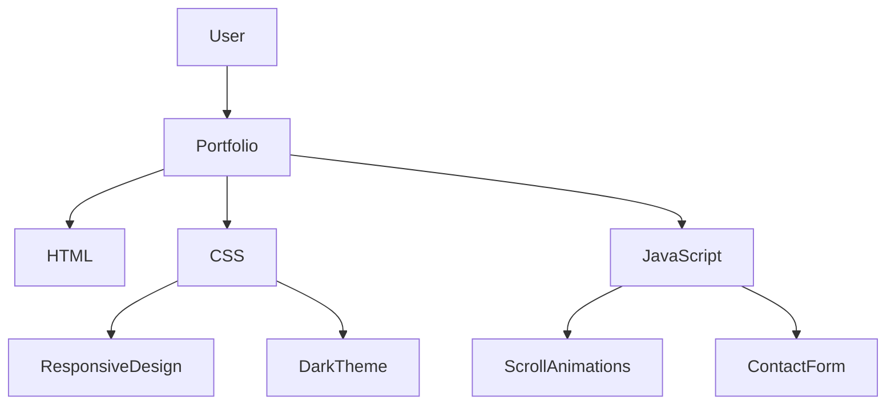

<div align="center">

# 👋 My Portfolio

### Crafting digital experiences with clean code, thoughtful design, and modern web technologies.

<p align="center">


</p>

<p align="center">


</p>

<p align="center">

<a href="https://myportfolioaimsangai.vercel.app/">
Live Demo
</a>

•

<a href="https://github.com/aimranesangai/My_Portfolio">
Repository
</a>

</p>

</div>

---

# ✨ Overview

A modern developer portfolio showcasing projects, skills, and contact information through a polished user experience.

The website focuses on:

- Clean aesthetics
- Smooth interactions
- Responsive layouts
- Recruiter-friendly presentation
- Lightweight performance
- Elegant animations

---

# 🚀 Features

### 🎨 Modern Interface

Beautiful dark theme designed for readability.

### ⚡ Smooth Scroll Animations

Elements gracefully slide into view while navigating.

### 📱 Fully Responsive

Optimized for:

- Desktop
- Tablet
- Mobile


### 📬 Contact Section

Simple contact form interface.

*(Frontend implementation only)*


### 🧩 Lightweight Architecture

No frameworks.

No unnecessary dependencies.

Pure frontend craftsmanship.


---

# 🛠 Tech Stack


## Frontend

```text
HTML5
CSS3
JavaScript
````

## Skills Showcase

```text
React
TypeScript
TailwindCSS
NodeJS
PHP

MySQL
PostgreSQL
MongoDB
GraphQL

Prisma

Docker
Kubernetes

AWS
Vercel

Framer Motion

Figma

Jest
Playwright
```

---

# 📷 Screenshots

## Desktop View

<p align="center">



</p>

## Mobile View

<p align="center">


</p>

## Contact Section

<p align="center">


</p>

> Replace these placeholders with actual screenshots.

---

# 🏗 Project Structure

```bash
My_Portfolio/
│
├── images/
│
├── index.html
│
├── styles.css
│
├── main.js
│
└── README.md

```

---

# ⚙️ Installation

Clone repository

```bash
git clone https://github.com/aimranesangai/My_Portfolio.git
```

Move inside

```bash
cd My_Portfolio
```

Launch locally

```bash
open index.html
```

Or

```bash
Live Server
```

---

# 🌐 Deployment

Hosted using:

### Vercel

Deployment URL

```bash
https://myportfolioaimsangai.vercel.app/
```

---

# 🧠 Architecture



---

# 🎯 Goals

This portfolio aims to:

Showcase projects

Demonstrate frontend capabilities

Attract recruiters

Land freelance clients

Track personal growth

Build an online presence

---

# 📈 Future Improvements

* [ ] Backend contact form

* [ ] Email integration

* [ ] Blog section

* [ ] Project filtering

* [ ] Theme switcher

* [ ] CMS integration

* [ ] Analytics dashboard

* [ ] Downloadable Resume

* [ ] Multi-language support

---

# 🤝 Connect With Me

## Email

```text
aim.sangai@gmail.com
```

## LinkedIn

```text
linkedin.com/in/aimrane-sangai-13a1b1413
```

## GitHub

```text
github.com/aimranesangai
```

## Instagram

```text
instagram.com/aimrane.sangai
```

## X

```text
x.com/AimSangai
```

## Discord

```text
aimrane_sangai
```

---

# 💼 Why This Portfolio Exists

I believe portfolios should do more than list technologies.

They should communicate:

• Attention to detail

• Design sensibilities

• Problem-solving abilities

• Consistency

• Passion for continuous learning

This project reflects my current journey as a developer and serves as a foundation for future work.

---

# ⭐ Support

If you enjoyed this project:

Consider giving it a ⭐

Fork it.

Share feedback.

Connect with me.

Every contribution, suggestion, and conversation is appreciated.

---

# 📄 License

MIT License

Copyright (c) 2026 Aimrane SANGAI

Permission is hereby granted, free of charge, to any person obtaining a copy
of this software and associated documentation files (the "Software"), to deal
in the Software without restriction, including without limitation the rights
to use, copy, modify, merge, publish, distribute, sublicense, and/or sell
copies of the Software, and to permit persons to whom the Software is
furnished to do so, subject to the following conditions:

The above copyright notice and this permission notice shall be included in all
copies or substantial portions of the Software.

THE SOFTWARE IS PROVIDED "AS IS", WITHOUT WARRANTY OF ANY KIND, EXPRESS OR
IMPLIED, INCLUDING BUT NOT LIMITED TO THE WARRANTIES OF MERCHANTABILITY,
FITNESS FOR A PARTICULAR PURPOSE AND NONINFRINGEMENT. IN NO EVENT SHALL THE
AUTHORS OR COPYRIGHT HOLDERS BE LIABLE FOR ANY CLAIM, DAMAGES OR OTHER
LIABILITY, WHETHER IN AN ACTION OF CONTRACT, TORT OR OTHERWISE, ARISING FROM,
OUT OF OR IN CONNECTION WITH THE SOFTWARE OR THE USE OR OTHER DEALINGS IN THE
SOFTWARE.


See the full MIT license here:

https://opensource.org/licenses/MIT

---

<div align="center">

### Thank you for visiting.

*"Building experiences that are simple, elegant, and meaningful."*

</div>
